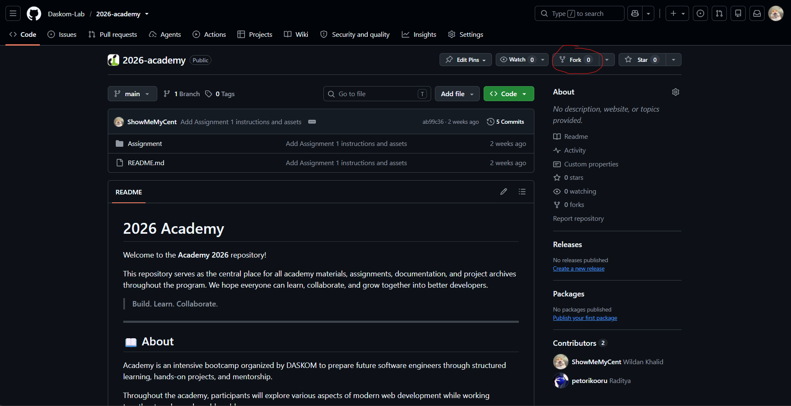
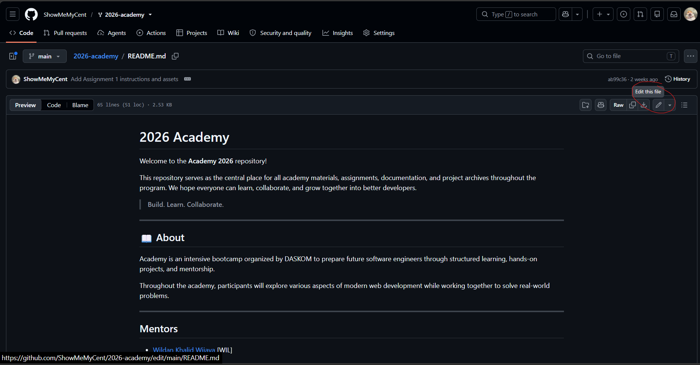
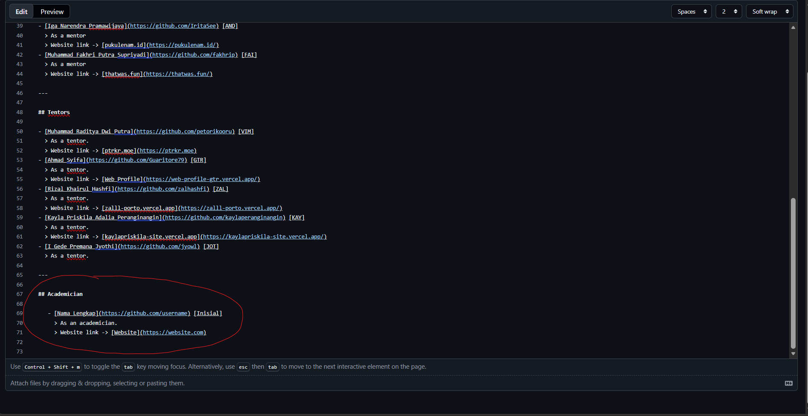
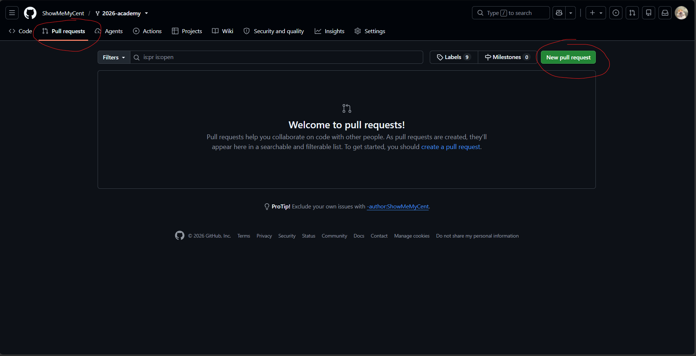
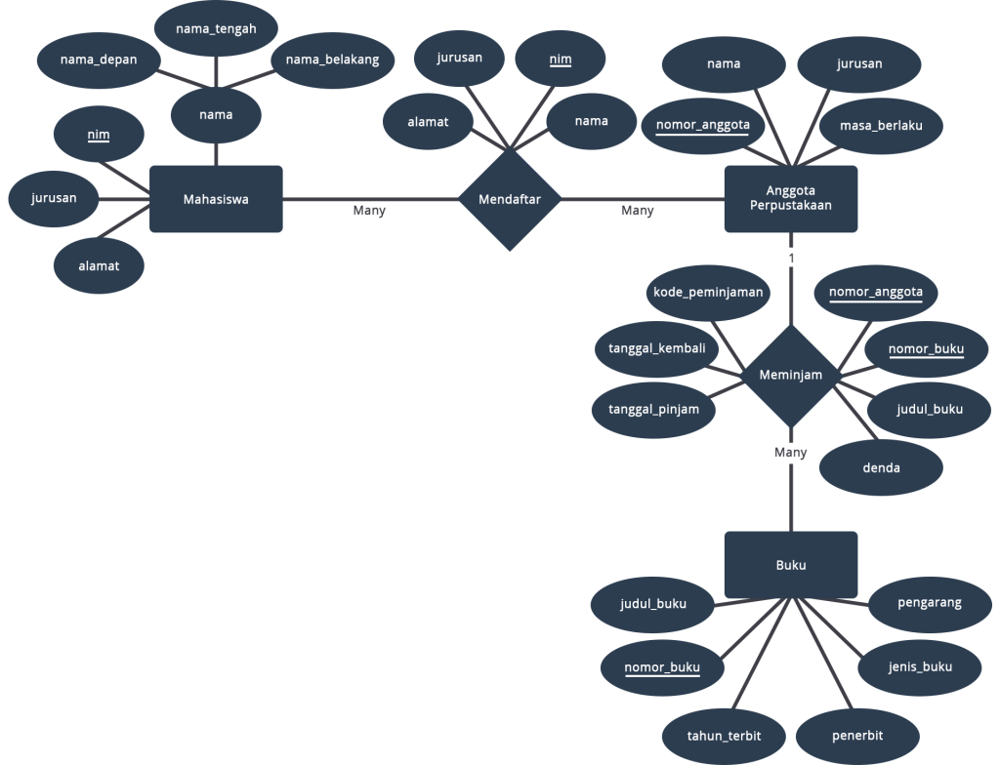
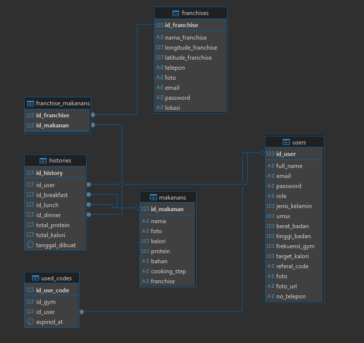

# 📌 Academy - Tugas 2: Entity Relationship Diagram (ERD) & Implementasi Database

Pada tugas ini, setiap peserta diminta untuk melakukan **perancangan database** berdasarkan studi kasus yang diberikan, kemudian mengimplementasikannya menggunakan **phpMyAdmin**.

## 📖 **Studi Kasus**

### **NIM Ganjil** — Sistem Manajemen Perpustakaan

Buatlah rancangan database untuk sebuah perpustakaan yang memiliki ketentuan berikut:

- Perpustakaan menyimpan data buku.
- Setiap buku memiliki satu kategori.
- Perpustakaan memiliki data anggota.
- Anggota dapat meminjam lebih dari satu buku.
- Satu buku dapat dipinjam oleh banyak anggota pada waktu yang berbeda.
- Setiap transaksi peminjaman memiliki tanggal pinjam dan tanggal kembali.

---

### **NIM Genap** — Sistem Penjualan Toko

Buatlah rancangan database untuk sebuah toko dengan ketentuan berikut:

- Toko menyimpan data produk.
- Setiap produk memiliki satu kategori.
- Toko menyimpan data pelanggan.
- Pelanggan dapat melakukan banyak transaksi.
- Setiap transaksi dapat terdiri dari beberapa produk.
- Setiap transaksi memiliki tanggal transaksi dan total pembayaran.

## 📋 Ketentuan

1. Identifikasi seluruh **entity**, **attribute**, dan **relationship** dari studi kasus.
2. Buat **Entity Relationship Diagram (ERD)**.
3. Implementasikan database menggunakan **phpMyAdmin**.
4. Pastikan setiap tabel memiliki **Primary Key**.
5. Gunakan **Foreign Key** apabila terdapat hubungan antar tabel.

## 💡 Catatan

- Peserta diperbolehkan menambahkan attribute atau entity apabila dianggap diperlukan, selama tetap sesuai dengan studi kasus.
- Pastikan hasil implementasi sesuai dengan ERD yang dibuat.

## ⭐ Tugas Tambahan - Git & GitHub

Lakukan langkah-langkah berikut:

1. Fork repository berikut: [2026-academy](https://github.com/Daskom-Lab/2026-academy)
   

2. Buka file **README.md.**
   

3. Tambahkan section Academician di bawah section Tentors dengan format berikut:

   ```
   ## Academician

   - [Nama Lengkap](https://github.com/username) [Inisial]
   > As an academician.
   > Website link -> [Website](https://website.com)
   ```

   Contoh:
   

4. Commit perubahan tersebut, dan buat pull request
   

## 📤 Yang Dikumpulkan

Silakan dijadikan zip dan upload [**disini**](https://forms.gle/bBgavMJERnLwYNaDA) :

1. Screenshot **ERD**.
   contoh: 
2. Screenshot **Structure/Schema** database pada **phpMyAdmin** yang memperlihatkan seluruh tabel.
   contoh: 
3. File **.sql** hasil export database.

## Semangat mengerjakan!🧑‍💻
